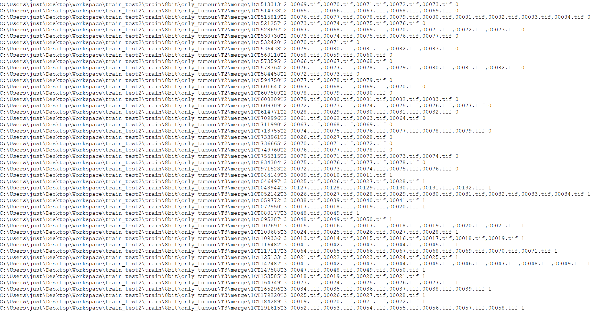

## End-to-End Deep Learning Model with Multi-channel and Attention Mechanisms for Multi-class Diagnosis in CT-T Staging of Advanced Gastric Cancer  

This repository contains the code for an end-to-end deep learning model for T staging of advanced gastric cancer  

1. The training files are located in the 'train' folder  
1. The files under 'predict' are 'comparison between predicted and true' and 'prediction only'  
1. Store model files in the model folder  
1. The training data format requires the fusion input of segmented images and gastric CT images，During training and testing, it is necessary to provide an image path table, as shown in the following figure
